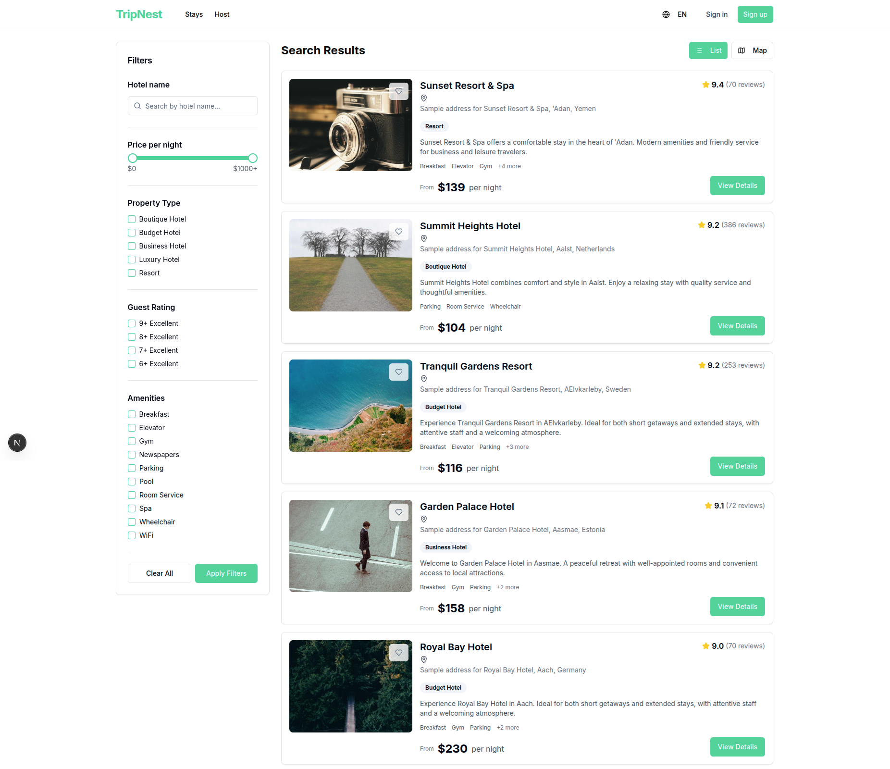

# Trip Nest

Hotel booking platform: **Django REST API** (`backend/`) and **Next.js** dashboard (`frontend/`).

## Features (high level)

- Hotels, rooms, facilities, locations (countries / cities), and search-oriented listing APIs
- Bookings and guest flows
- Users with JWT auth (access / refresh), roles (guest / host), host verification, wishlist
- Admin-oriented endpoints for catalog and property management
- OpenAPI docs (e.g. `/api/docs/`, `/api/redoc/`)

## Screenshots

### Home


### Search / listing



## Observability

### OpenTelemetry (traces)

The backend configures an OTLP **HTTP** trace exporter so spans can be sent to a collector or Jaeger. In `backend/backend/settings.py` the service is named **`trip-nest-backend`** and the default endpoint is **`http://localhost:4318/v1/traces`**.

Backend dependencies (including OpenTelemetry API/SDK, OTLP exporter, and optional Django instrumentation) are in `backend/requirements.txt`. Run the API as usual; spans are batched and exported over OTLP.

### Structlog (logs)

Logs are structured as **JSON** on the console: timestamps, levels, and (when a trace is active) **`trace_id`** / **`span_id`** merged from the current OpenTelemetry span so logs and traces can be correlated in Jaeger or your log stack.

**django-structlog** request middleware records per-request context; DRF errors are also logged via a custom exception handler.

### Jaeger UI (Docker)

Run Jaeger locally with OTLP HTTP on **4318** so it matches the backend default:

```bash
docker run -d --name jaeger \
  -p 16686:16686 \
  -p 4318:4318 \
  jaegertracing/all-in-one:latest
```

- **Jaeger UI:** http://localhost:16686  
- **OTLP HTTP (traces):** `http://localhost:4318` (full path used by the app: `/v1/traces`)

Equivalent **Docker Compose** snippet:

```yaml
services:
  jaeger:
    image: jaegertracing/all-in-one:latest
    ports:
      - "16686:16686"
      - "4318:4318"
```

Start Jaeger before the Django server if you want traces to appear on every request. If nothing is listening on `4318`, export may fail silently or log errors depending on your OpenTelemetry setup.
